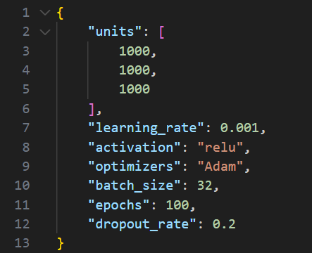

# 📋 Le format JSON

Le format **JSON** (JavaScript Object Notation) est très populaire pour sauvegarder des configurations ou des résultats d'expériences car il est lisible par les humains et facile à utiliser avec Python.

C'est particulièrement utile pour conserver les **hyperparamètres** de nos réseaux de neurones.

## Importer le module

Python possède un module natif pour gérer le JSON :

```python
import json
```

## Sauvegarder des hyperparamètres : `json.dump()`

Imaginons que vous ayez configuré une expérience avec les hyperparamètres suivants stockés dans un dictionnaire :

```python
hyperparametres = {
    "units" : [1000, 1000, 1000],
    "learning_rate" : 0.001,
    "activation" : "relu",
    "optimizers" : "Adam",
    "batch_size" : 32,
    "epochs" : 100,
    "dropout_rate" : 0.2,
}
```

Pour sauvegarder ce dictionnaire dans un fichier :

```python
# Définition du nom du fichier
fichier_config = "config.json"

# Ouverture du fichier en mode écriture ('w')
with open(fichier_config, 'w') as f:
    json.dump(hyperparametres, f, indent=4)
```

> L'argument `indent=4` permet de formater le fichier JSON pour qu'il soit plus lisible (avec des indentations).

Si on ouvre le fichier avec un éditeur, on pourra voir:

<center></center>

## Charger une configuration : `json.load()`

Pour réutiliser ces paramètres plus tard ou dans un autre script, vous pouvez lire le fichier JSON et le convertir directement en dictionnaire Python.

```python
fichier_config = "config.json"

# Ouverture du fichier en mode lecture ('r')
with open(fichier_config, 'r') as f:
    params_charges = json.load(f)

print(f"Learning rate : {params_charges['learning_rate']}") 
# >>> Learning rate : 0.001
```